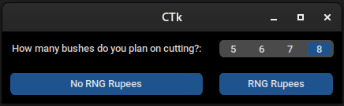

# Any-RNG-Tracker
A tool for tracking RNG for The Legend of Zelda: Ocarina of Time Any% speedruns.

In this speedrun, you have to hope that you get a specific number of rupees from a couple of bushes, something that is entirely luck based.

This tool helps you analyze your session's runs, to see if you're getting above average or below average RNG.

## Usage
To use this tool, you must have python3 installed. I'm using 3.12.7 but anything newer than that should work just fine

This tool depends on:
1. customtkinter
2. matplotlib

This means that before you can run this program, you must:

`pip install customtkinter`

`pip install matplotlib`
## Main Interface


The interface for this app is very simple. You open the tool, select how many bushes you are going to cut in your runs, and then select "No RNG rupees" if you don't get 28 rupees in those bushes, or "RNG Rupees" if you do get 28+ rupees in those bushes.

## Graph Overlay


When you click one of the buttons on the tool, a GraphOverlay.png file is created in the same directory as the main python file.

It shows a line for the expected RNG based on the amount of bushes you are selecting, and also a line that represents your current RNG.

You can add this image as a source in OBS and it should update once you press a button on the program.

## Text Overlay

When you click one of the buttons on the tool, a TextOverlay.txt file is created

```
Total Runs: 8
Total Runs with RNG: 2
Bush Cutting Goal: 6
```
It shows how many runs you have done, how many times you've gotten the RNG bushes, and how many bushes you are planning on cutting in your runs.

Just like the graphoverlay, you can add this as text to OBS, and it should update everytime you press a button on the program.